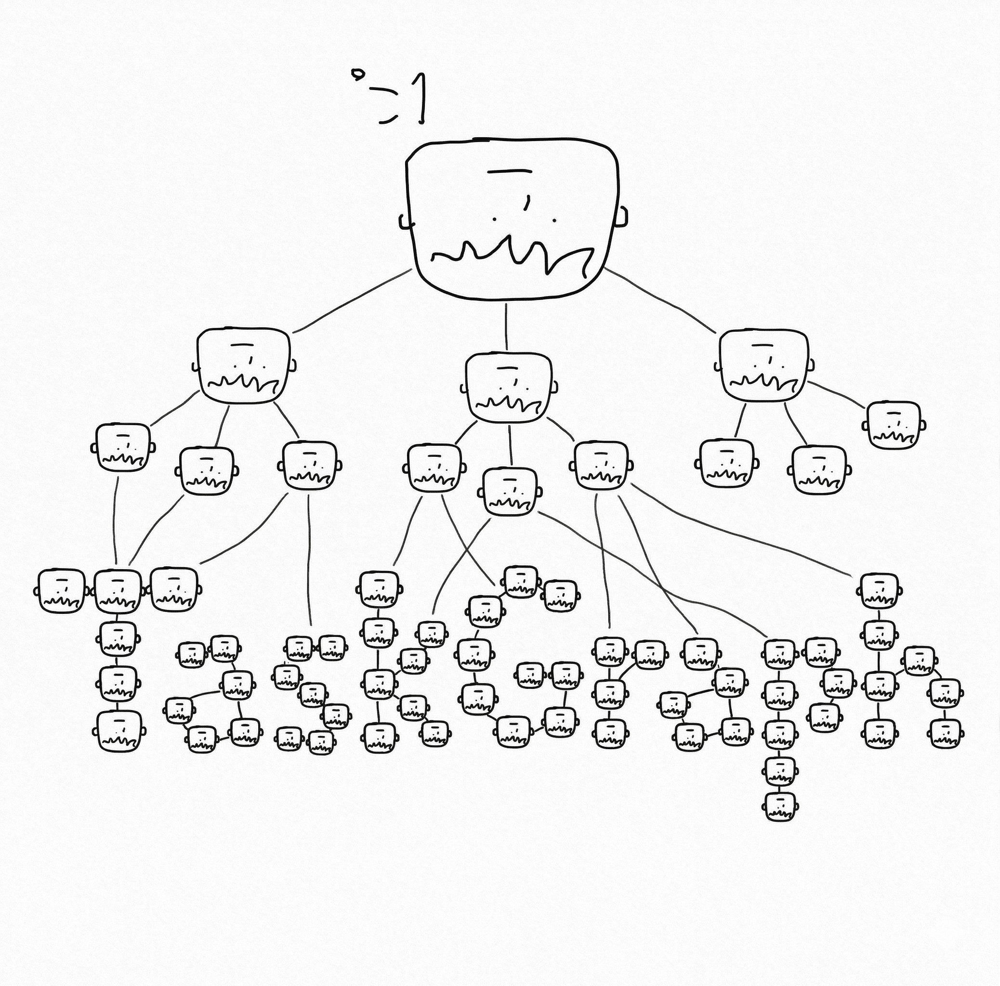

# taskgraph

  

taskgraph is an Obsidian-first task system for managing work as a readable, editable graph.

This organization exists first and foremost to manage `@ubugeeei`'s task landscape.

`public-vault` is not only a public mirror. It is also the public intake surface: when someone outside the organization opens a pull request against `public-vault`, that pull request functions as a practical task request against the public graph.

This organization is shaped around three repositories:

- `config`
- `public-vault`
- `private-vault`

It is built around two simple rules:

- Every task is a file.
- Every task is a graph.

It aims to make task management calm, precise, beautiful, and enjoyable without giving up structure.

## Design principles

- every task is a file
- every task participates in a graph
- public and private knowledge stay separated by default
- weekly and monthly focus remain visible at the note level and on the public dashboard
- all content and conventions are written in English
- schema and graph integrity should be mechanically verifiable

## Purpose

taskgraph exists to make long-running work easier to see and easier to steer.

- turn tasks into durable notes instead of disposable checklist items
- keep relationships between tasks explicit
- make weekly and monthly focus visible at a glance
- keep editing comfortable through Obsidian-first workflows

It is also meant to create a legible request channel. The public side is intentionally open enough that collaborators and outsiders can propose work by sending pull requests to `public-vault`.

## Concept

The system is intentionally split by visibility.

- `public-vault` is the public-facing slice
- `private-vault` is the private execution side
- `config` holds the shared schema, templates, and Obsidian setup

That split makes it possible to publish the shape of ongoing work without exposing private details.

## Repositories

- `config`
  Shared schema, templates, Obsidian configuration, and validation scripts.
- `public-vault`
  The public-facing vault and GitHub Pages surface.
- `private-vault`
  The private execution vault for details that should not be published.

## Core ideas

- Task files stay flat.
- Weekly and monthly attention live in the single `focus` property.
- Public and private views are split into separate repositories.
- Graph relations stay easy to edit through Obsidian GUI tooling.

## Editing stack

- Obsidian Properties
- Dataview
- Metadata Menu
- ExcaliBrain
- Vite

## Public boundary

`public-vault` is intentionally partial. It contains only public-facing tasks.

Private execution detail lives in `private-vault`, and work-managed streams are tracked elsewhere. In other words, the public graph is a real graph, but not the whole graph.

At the same time, `public-vault` is intentionally actionable. A pull request from an outsider is treated as a concrete request against the public task graph, not just as passive feedback.
